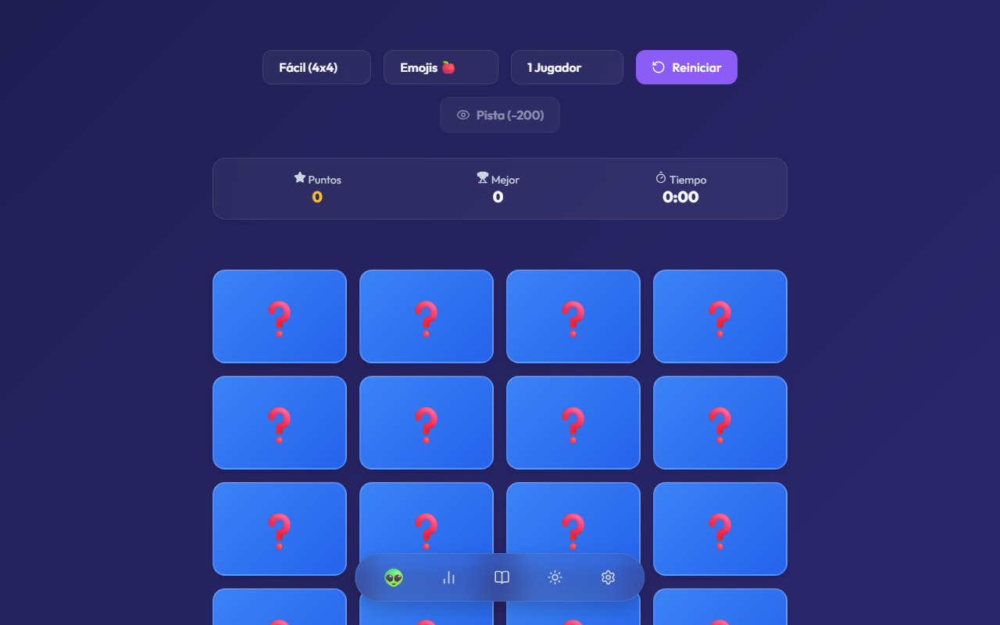
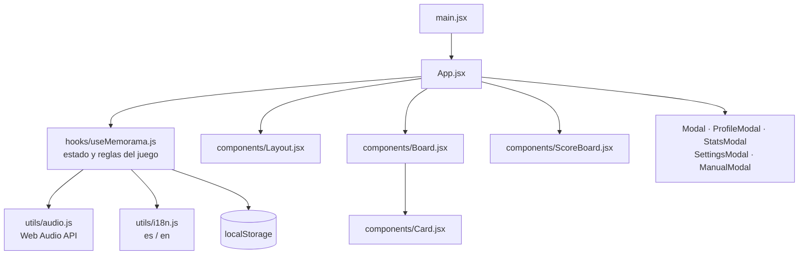

<div align="center">
  
  <h1>MemoFlash</h1>
  <p><b>Juego de memoria (memorama) como PWA: modos solitario, contrarreloj y 1 vs 1 local, con audio 8-bit generado en el navegador.</b></p>
  
  
  
  
  
  <a href="https://github.com/Luiss2080/MemoFlash/actions/workflows/ci.yml"></a>
  
  <p>
    <a href="#-inicio-rápido">Inicio rápido</a> ·
    <a href="#-características">Características</a> ·
    <a href="#-arquitectura">Arquitectura</a> ·
    <a href="#-pruebas">Pruebas</a> ·
    <a href="#-lo-que-todavía-no-existe">Limitaciones</a>
  </p>
</div>

MemoFlash es una aplicación web de una sola pantalla construida con React y Vite, instalable como PWA (`vite-plugin-pwa`). Todo ocurre en el navegador: **no tiene backend, cuentas ni ranking en línea**; el perfil, el idioma, el tema y las estadísticas se guardan en `localStorage`.

## 🎬 Vista rápida

<p align="center">
  
</p>

## ✨ Características

| Característica | Detalle |
| --- | --- |
| Modos | Solitario; Contrarreloj (60 s iniciales, +5 s por acierto); Multijugador local 1 vs 1 con turnos y marcador por jugador |
| Dificultad | Fácil 4x4 (8 parejas), Medio 4x6 (12), Difícil 6x6 (18) |
| Temas de cartas | Comida, Animales, Código/Tecnología y Banderas (emojis) |
| Puntuación | +100 por pareja más bono de rapidez, combos consecutivos, pista de 1 s por 200 puntos, bono de victoria |
| Interfaz | Dock inferior (perfil, estadísticas, manual, tema, ajustes), tema oscuro/claro, español e inglés, cartas accesibles con teclado |
| Persistencia | Perfil local (nombre + avatar), idioma, tema y estadísticas en `localStorage` |
| Audio | Efectos y música de fondo con osciladores de la Web Audio API, sin archivos de audio |
| PWA | Service worker autoactualizable y manifiesto instalable (el build precachea 6 archivos) |

## 🏗️ Arquitectura



## 🚀 Inicio rápido

| Requisito | Versión |
| --- | --- |
| Node.js | 20 o superior (el CI usa 20) |
| npm | el que trae Node |

```bash
git clone https://github.com/Luiss2080/MemoFlash.git
cd MemoFlash
npm ci
npm run dev
```

Abre la URL que imprime Vite (por defecto `http://localhost:5173/`). Otros comandos verificados:

```bash
npm run build     # build de producción con service worker
npm run preview   # sirve el build localmente
npm run lint      # oxlint
```

<details>
<summary>Estructura de carpetas</summary>

```text
MemoFlash/
├── src/
│   ├── App.jsx, main.jsx, index.css
│   ├── components/   # Board, Card, Layout, ScoreBoard y modales
│   ├── hooks/        # useMemorama.js (lógica del juego)
│   ├── utils/        # audio.js, i18n.js
│   └── tests/        # 3 archivos de test + setup
├── public/           # favicon.svg, icons.svg
├── spec.md, MANUAL.md, AGENTS.md
└── .github/workflows/ci.yml
```

</details>

<details>
<summary>Stack y dependencias</summary>

React 19, Vite 8, Framer Motion, canvas-confetti, Lucide React, vite-plugin-pwa; pruebas con Vitest 5 + React Testing Library + jsdom; lint con oxlint. Estilos en CSS propio con variables, sin framework CSS.

</details>

## 🧪 Pruebas

```bash
npm test   # vitest run
```

23 tests en 3 archivos (`useMemorama.test.js`, `useMemorama.logic.test.js`, `useMemorama.raceCondition.test.js`) sobre el hook `useMemorama`: mazo, parejas, combos, victoria, pistas, Contrarreloj y condiciones de carrera al reiniciar. No hay tests de los componentes visuales ni E2E. El CI (`.github/workflows/ci.yml`) ejecuta lint, tests y build en cada push y PR a `main`.

## 🔒 Seguridad

No hay servidor ni datos sensibles: solo `localStorage` del propio navegador.

## 🚧 Lo que todavía no existe

- Ranking o puntuaciones en línea, cuentas y multijugador en red (el 1 vs 1 es en la misma pantalla).
- Cartas con imágenes: los mazos son solo emojis.
- Idiomas distintos de español e inglés.
- Tests de interfaz y E2E.
- Íconos PWA propios: el manifiesto reutiliza `favicon.svg` para los tamaños 192 y 512.

## 📄 Licencia

MIT, ver [`LICENSE`](./LICENSE).

<div align="center"><sub>Hecho por Luiss2080 · Construido con Spec-Driven Development (ver <code>spec.md</code>)</sub></div>
